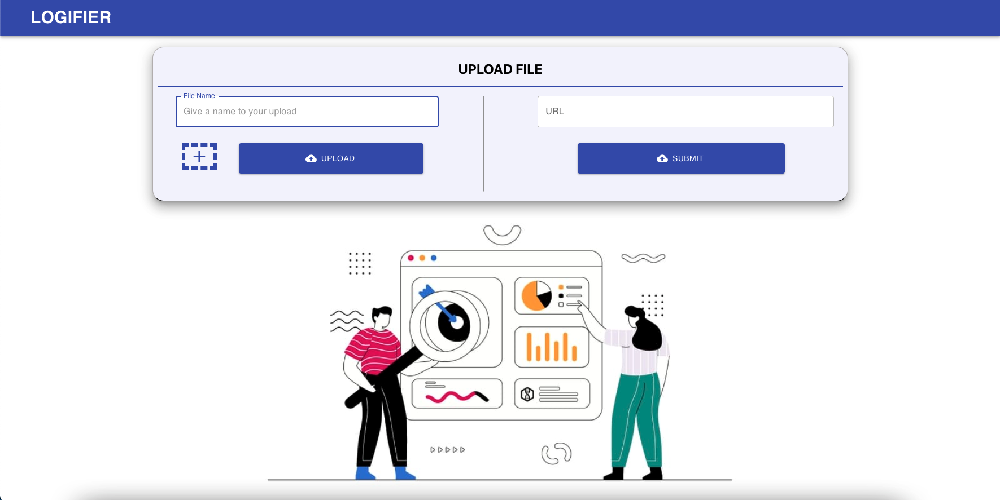
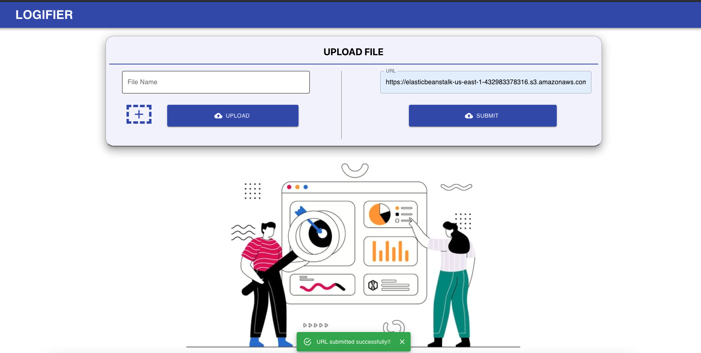
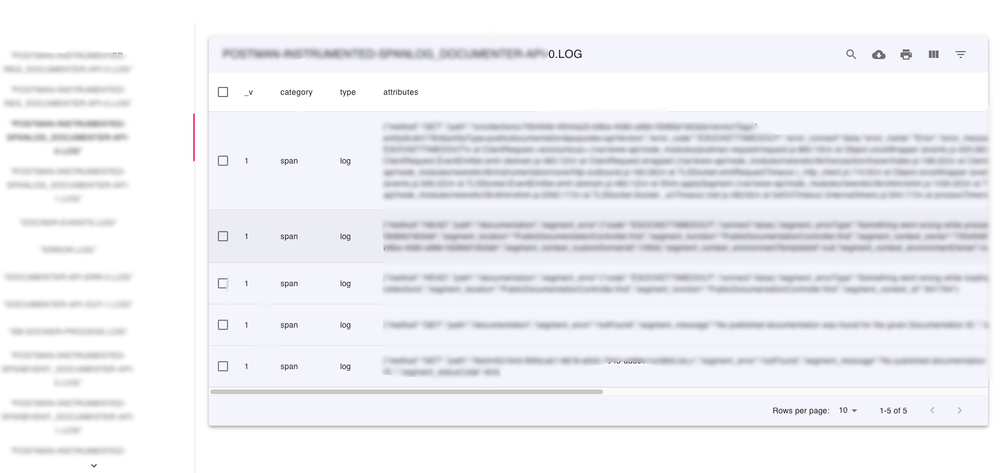
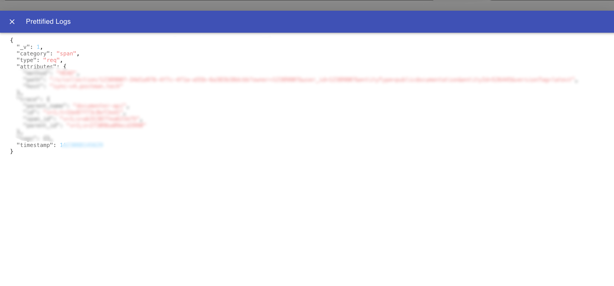

# Logifier

Logifier is Single Page application which transform AWS beanstalk logs and present them in prettified manner.
 
It converts logs in the form of a prettified table which is easy to read and understand and provides multiple facilities like search, filter according to columns or values, sort and many more...

## How to Run the Application Locally
- Clone the repository : 
    ```
    git clone https://github.com/Himanshu0809/logifier.git
    ```
- Install all the dependencies for :
    - Server
        ```
        npm install
        ```
        **NOTE**: Server will be running on `PORT : 5000`

    - Client
        ```
        cd client/
        npm install
        ```
        **NOTE**: Client will be running on `PORT : 3000`

- Go to the root project directory again.

    - **`For mac/linux`**


        - If you want to open it in **browser**:
            ```
            ./run-server.sh browser
            ```

        - If you want to open it in **electron app**:
            ```
            ./run-server.sh
            ```

    - **`For windows`**
        - Create a folder **`uploads`** inside server directory.
            ```
            cd server
            mkdir uploads
            ```

        - If you want to open it in **browser**:
            ```
            npm run server
            cd client/
            npm run client-browser
            ```

        - If you want to open it in **electron app**:
            ```
            npm run server
            cd client/
            npm run client-app
            ```

## How to Run Chrome Extension (**LogXtension** :wink:)
- First, run the application locally.
- Go to chrome extensions: [Chrome extensions](chrome://extensions/) and Switch on the ***developer mode.***


- Click on ***Load Unpacked*** button and inside the project directory, select the *`chromeExtension`* folder.
- Now go to AWS Beanstalk Logs URL and click on Logifier Extension.
- Click on `See logs`. It will redirect you to the application with URL entered automatically in the field.


## TO-DO

- [ ] Automatic URL detection by extension 
- [ ] Adding continuous stream of logs
- [ ] Generalized Parsing Logic

## TECH STACK

  - **CLIENT-SIDE:**
    - **REACT JS** - An open-source JavaScript library for building user interfaces.
    - **Material UI** - Most powerful and efficient tool to build an Application by adding Designs and Animations 
    - **Styled Components** - Successor to CSS Modules, a way to write CSS that's scoped to a single component, and not leak to any other element in the page.
    - **Electron** - An open-source software framework developed and maintained by GitHub.
    - **Shell Scripting** - A computer program designed to be run by the Unix shell, a command-line interpreter.
    
  - **SERVER-SIDE:**
    - **NODE JS** - JavaScript runtime environment that executes JavaScript code outside of a browser.
    - **ExpressJS** - Web application framework for Node.js for building web applications and APIs.

  - **CHROME EXTENSION:**
    - **VanillaJS** 
    - **HTML**
    - **CSS**
    
  - **TESTING:**
    - **POSTMAN** - API client tool to create, share, test and document APIs easily.


## SCREENSHOTS
- Home Page 

    

- URL

    

- Logs Table

    

- Each Prettified Log

    

- Extension

    

## CONTRIBUTE
- To file any issue :point_right:  [here](https://github.com/Himanshu0809/Team-Eagle/issues) 
- Feel free to contribute :smile: 